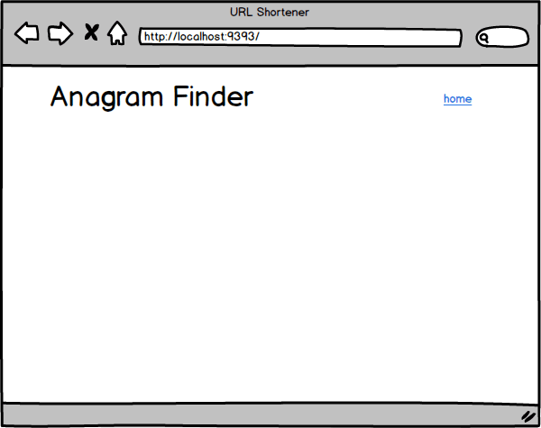
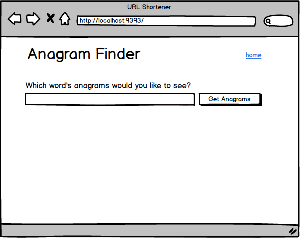

# Анаграммы в веб-приложении

## Общие сведения
Мы собираемся написать веб-приложение, поддерживаемое базой данных. Пользователи впишут слово, наше приложение получит доступ к базе данных для извлечения анаграмм для этого слова, и список анаграмм будет предоставлен пользователю.

Когда создаете приложение, помните о том, каким образом происходит обмен данными между клиентом и сервером. Браузер будет отправлять данные через HTTP-запросы в Express, какими должны быть эти данные? После того, как сервер получит данные от пользователя, маршрутизатор обработки запросов контроллера должен запросить у модели получение анаграмм. Затем маршрутизатор обработки запросов отображает представление для данных, возвращаемых моделью. Наконец, сервер возвращает отображаемый HTML в браузер. 


## Releases
### Пре-релиз: Установка Модулей
Убедитесь, что модули, необходимые для приложения, были установлены. В командной строке запустите `npm install`.

### Release 0: Создание модели и миграций для слов
Если мы собираемся искать базу данных для анаграмм данного слова, сначала нужно сохранить несколько слов в базе данных. Создайте базу данных с таблицей `words` (слов) и моделью для представления слов в Sequelize.


1. Создайте модель `Word`.

2. Напишите миграцию в таблицу `words`. Какие данные необходимо хранить в таблице? Нам нужно сохранить каждое из слов, перечисленных в файле `db/fixtures/abridged_word_list.txt`.


### Release 1: Пополнение Базы данных
В нашей базе данных есть таблица `words`. Теперь мы добавим некоторые исходные данные в базу данных; это называется *засеять* базу данных. Данные, которыми мы будем пополнять нашу базу данных, хранятся в файле `db/fixtures/abridged_word_list.txt`. Нам нужно сохранить каждое слово в этом файле в виде слова в нашей базе данных. 

Напишите код, который будет пополнять нашу базу данных, в файле `db/seeds.js`. Нам нужно указать, как сохранить каждую строку из файла в виде объекта `Word` в базе данных.

Чтобы приступить к созданию кода запустите `db/seeds.js`:

```js
npx sequelize db:seed:all
```

### Release 2: Модель Words находит анаграммы
Наше приложение должно найти анаграммы для данного слова. Наша модель `Word`  будет ответственна за эту функцию. Экземпляр класса `Word` вернет свои анаграммы:

```js
let Word = sequelize.define('word', {...})

Word.prototype.anagrams = () => {
    # Returns a collection of Word objects that are anagrams
    # of the instance on which the method is called.
  }

```


### Release 3: Как показать анаграммы Слова
Мы собираемся начать разработку нашего веб-приложения, разрешив пользователям просматривать анаграммы для слова. Когда пользователи посещают URL-адрес, например `http://localhost:3000/words/leaps`, там должны быть указаны анаграммы данного слова (см. Рисунок 1). Используйте метод `Word.anagrams`, который мы описали в *Release 2*. 

*Примечание:* Помните, что наша база данных имеет ограниченное количество слов (например, leaps, melon и т.д.), поэтому мы не сможем найти анаграммы для всех английских слов. Если мы хотим, чтобы список слов в нашей базе данных был более исчерпывающим, мы можем обновить базу данных, используя файл `db/fixtures/word_list.txt`.



*Рисунок 1*.  Отображение анаграмм для заданного слова.


### Release 4: Запрос анаграмм с помощью формы
На данный момент, чтобы просмотреть анаграммы слов, пользователи должны вручную ввести URL-адрес. Добавьте на главную страницу форму, которая позволит пользователям задать слово, анаграммы которого они хотели бы увидеть. (см. Рисунок 2)


*Рисунок 2*.  Использование формы для получения анаграмм слова. 


### Release 5: Добавление Формы на Страницу «Слова»
Форма на домашней странице удобна, но все же просматривать анаграммы нескольких слов пока проблематично. Чтобы облегчить перескакивание от слова к слову, добавьте форму с главной страницы на страницу «Слова». (см. рисунок 3)

Для этого мы собираемся использовать частичный шаблон (partial). [What is a partial?][partials in handlebars]" (см. Табличку с кратким изложением). Начните с переноса кода для формы с домашней страницы в частичный шаблон, а затем включите его в  домашнюю страницу. Использование частичного шаблона не должно изменять способ отображения страницы в браузере.

Когда заработает частичный шаблон, включите его в страницу, на которой перечислены анаграммы слов.

*Примечание:* Беспокойтесь больше о функциональности формы, чем о том, чтобы отобразить ее точно так, как показано на макете.



*Рисунок 3*.  Форма, добавленная на страницу, показывающую анаграммы слов.

## Заключение
Мы создали веб-приложение, поддерживаемое базой данных. Можем ли мы отследить, каким образом данные передаются через наше приложение? Когда наш сервер получает запрос на показ анаграмм слова, что происходит? Каковы функции модели, представления и контроллера?


<!-- 
[create_table]: http://api.rubyonrails.org/classes/ActiveRecord/ConnectionAdapters/SchemaStatements.html#method-i-create_table
[form animation]: readme-assets/form-animation.gif
[form on page]: readme-assets/form-on-page.gif
[word page animation]: readme-assets/word-page-animation.gif
[partials in handlebars]: https://www.learnhowtoprogram.com/lessons/partials-in-sinatra#cheat-sheet
[sinatra_partials]: http://www.sinatrarb.com/faq.html#partials -->
